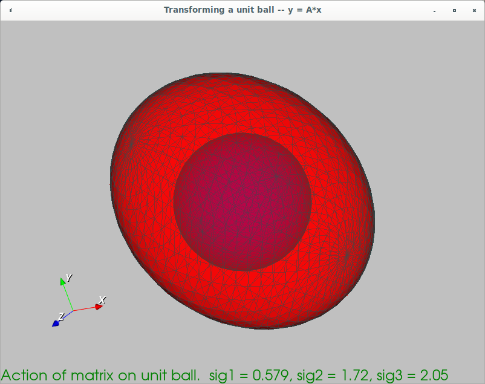

This is a starter VTK project.  The program creates a 3D unit ball x.
Then the program creates a random 3x3 matrix A and transforms the unit
ball using the matrix: y = A*x.  The resulting object is an ellipsoid.
The program then plots the unit ball and the resulting ellipsoid in
the same renderer and allowes the user to interact with it. 

The program also uses VTK's built-in SVD to compute the singular
values of the matrix A and display them on the screen.  The user can
see that the lengths of the three axes of the ellipsoid are the same
as the singular values of A.

If the user hits the key 'r' (refresh) then a new matrix is generated
and a new ellipsoid is drawn on the screen.

If the user hits the key 'q' (quit) then the program ends.

The goal of the program is to serve as a supplement to the
"visualizing a matrix" lecture in Northeastern's numerical analysis
class. 

To build the program, create a subdirectory called build.  Then 
cd into the build directory and do:

cmake ..
make

The run the program ./TransformUnitBall in the build directory.

Stuart Brorson
March, 2021.
